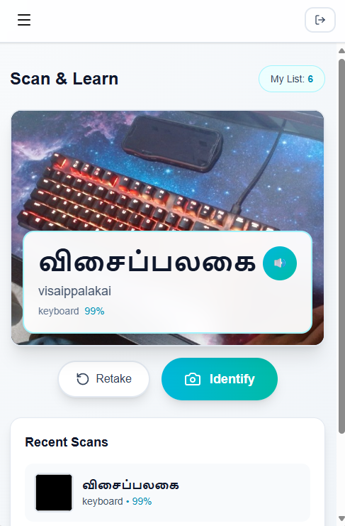
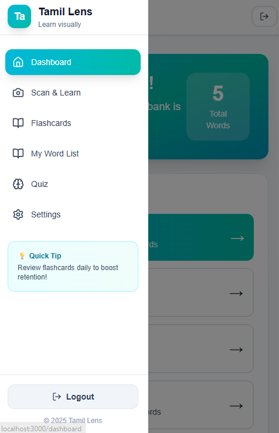

# Language Lens

**Language Lens** is an AR language learning demo where students learn vocabulary by scanning real-world objects around them.

Instead of memorizing flashcards, students explore their environment and instantly learn the name of objects in their **preferred language**.

### Core Feature
Scan real objects → instantly learn the word in another language.

### Supplementary Features
- Personal vocabulary list  
- Flashcard review  
- Quiz mode  
- Interactive **language treasure hunt**

---

# How It Works

### Agentic Workflow (Scan & Learn)

Camera Capture  
↓  
Image Safety Filter *(vision moderation layer blocks unsafe or irrelevant inputs)*  
↓  
Object Detection Service *(extracts object label from the image)*  
↓  
Lexicon API *(retrieves translations + transliterations from structured vocabulary database)*  
↓  
**Gemini API** *(adds contextual explanation + pronunciation guidance)*  
↓  
UI Renderer *(displays result and saves word to user vocabulary list)*

**Pipeline:**  
`capture → validate → detect → translate → enrich → render`

---

# Interactive Treasure Hunt

Students can turn any room into a **language discovery game**.

Students scan objects around them until the correct one is detected.

When found, the system displays:

- translated word  
- transliteration  
- pronunciation  
- detection confidence

This creates a **real-world reinforcement loop** where vocabulary is tied to physical objects.

---

# Demo

  
  

---

# How It's Built

### Frontend
- React  
- Next.js  
- Tailwind

### Backend
- Python  
- Flask

### AI + APIs
- Computer vision object detection
- **Lexicon API** *(custom translation + transliteration service)*  
- **Gemini API** *(language reasoning and contextual learning output)*